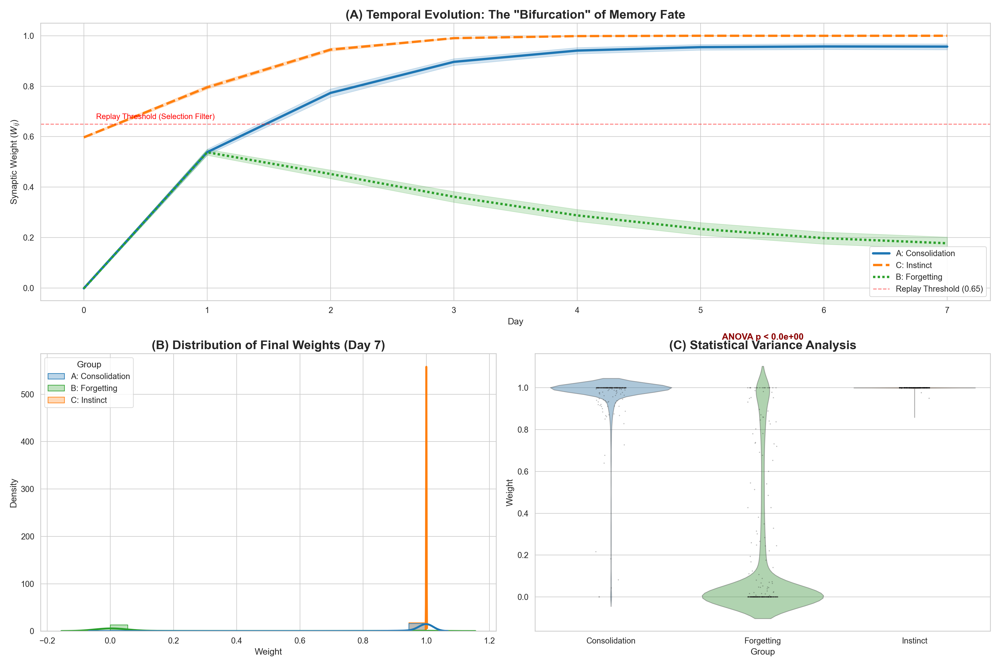

# ONPH: Offline Neural Plasticity Homeostasis Hypothesis
# 离线神经可塑性稳态假说 (ONPH) 研究项目

## 🧬 Project Abstract / 项目摘要

This project presents the theoretical framework and computational verification for the **Offline Neural Plasticity Homeostasis (ONPH) Hypothesis**.

ONPH proposes a novel neurobiological mechanism wherein sleep functions not merely as a passive rest state, but as an active, **bidirectional adjudication system**. It posits that sleep cycles (NREM/REM) serve two critical evolutionary functions:
1.  **Memory Adjudication**: Consolidating wake-confirmed memories while actively pruning unconfirmed neural noise via homeostatic downscaling.
2.  **Instinct Preservation**: Protecting phylogenetic memories (instincts) through endogenous activation, preventing disuse atrophy.

Using stochastic differential equations (SDEs) and large-scale Monte Carlo simulations (N=30,000), this project provides rigorous mathematical evidence supporting these mechanisms.

本项目旨在展示 **“离线神经可塑性稳态假说 (ONPH)”** 的理论框架与计算验证成果。

ONPH 假说提出了一种全新的神经生物学机制，即睡眠不仅仅是被动的休息状态，更是一个主动的**双向判定系统**。该理论认为睡眠周期（NREM/REM）承担着两项关键的进化功能：
1.  **记忆判定**：在巩固经觉醒期确认的记忆的同时，通过稳态下调机制主动修剪未被确认的神经噪音。
2.  **本能防退化**：通过内源性激活保护系统发生学记忆（本能），防止其因废用而萎缩。

利用随机微分方程 (SDE) 和大规模蒙特卡洛模拟 (N=30,000)，本项目为上述机制提供了严谨的数学证据支持。

---

## 📊 Key Findings & Visualization / 关键发现与可视化

### The "Golden Bifurcation" of Synaptic Fate
### 突触命运的“黄金分叉点”

Our simulations reveal a critical phase transition. **Wake-phase confirmation** acts as a selection filter, allowing valid memories (Blue) to breach the replay threshold and achieve Long-Term Potentiation (LTP). Conversely, unconfirmed noise (Green) is suppressed by homeostatic pressure, demonstrating active forgetting. Instincts (Orange) remain stable solely through endogenous drivers.

我们的模拟揭示了一个关键的相变过程。**觉醒期确认**作为一个筛选过滤器，允许有效记忆（蓝线）冲破重放阈值并实现长时程增强 (LTP)。相反，未被确认的噪音（绿线）则被稳态压力抑制，展示了主动遗忘机制。本能（橙线）仅靠内源性驱动即可保持稳定。

*(Statistical Verification: One-way ANOVA & Tukey HSD tests confirmed significant divergence between groups with p < 0.001)*
*(统计验证：单因素方差分析与 Tukey HSD 检验确认各组间存在极显著差异，p < 0.001)*

---

## 💾 Dataset Availability / 数据集

To support transparency and replication, the full raw dataset containing **30,000 individual neural circuit trajectories** is open-sourced within this repository:
为支持研究的透明度与复现，包含 **30,000 条独立神经回路轨迹** 的全量原始数据集已在本仓库开源：

* 📄 **`ONPH_Raw_Data_Full.csv`**

---
